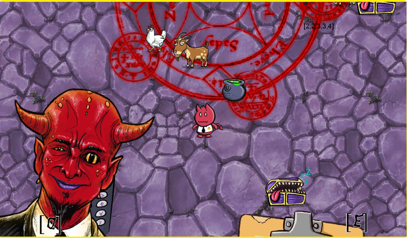
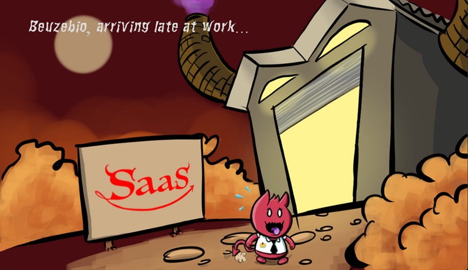

[JAVASCRIPT__BADGE]: https://img.shields.io/badge/Javascript-000?style=for-the-badge&logo=javascript
[KRITA__BADGE]: https://img.shields.io/badge/Krita-203759?style=for-the-badge&logo=krita&logoColor=EEF37B
[PHOTOSHOP__BADGE]: https://img.shields.io/badge/Adobe%20Photoshop-31A8FF?style=for-the-badge&logo=Adobe%20Photoshop&logoColor=black
[ITCHIO__BADGE]: https://img.shields.io/badge/Itch.io-FA5C5C?style=for-the-badge&logo=itchdotio&logoColor=white
[TRELLO__BADGE]: https://img.shields.io/badge/Trello-0052CC?style=for-the-badge&logo=trello&logoColor=white
[GIT__BADGE]: https://img.shields.io/badge/GIT-E44C30?style=for-the-badge&logo=git&logoColor=white

<div align='center'>
    
</div>
<a align="center" href="https://ldjam.com/events/ludum-dare/55">Ludum Dare 55 website</a>
<h1 align="center" style="font-weight: bold;">👹 👹 Summon as a Service 👹 👹</h1>

[](https://img.shields.io/badge/Made_with-GDevelop-purple)
[](https://github.com/ellerbrock/open-source-badge/)
[](https://github.com/ellerbrock/open-source-badge/)
<br>

<div align='center'>

![javascript][JAVASCRIPT__BADGE]
![krita][KRITA__BADGE]
![photoshop][PHOTOSHOP__BADGE]
[![itch.io][ITCHIO__BADGE]](https://games-ever-made.itch.io/saas-summoning-as-a-service)
![trello][TRELLO__BADGE]
![git][GIT__BADGE]

</div>

<p align="center">
 <a href="#about">About</a> • 
 <a href="#controls">Controls</a> • 
  <a href="#colab">Collaborators</a> •
 <a href="#references">References</a> •
 <a href="#aknowledges">Aknowledges</a> •
</p>

<p align="center">
    </img> |
    </img>
</p>

<h2 id="started">📌 About  </h2>

**Belzosbub**, tired of his role as torturer of poor human souls decides to resign from his position as Great General and founded the newest demon delivery service from hell. After a long market research, it became evident that cultists all over the world were spending too much time and money trying to gather materials needed for their routine rituals. Now it’s up to our “hero”, Belzebius, to serve his former commander general and now CEO in order to profit as much as they can from humans and bring glory and wealth to hell, although it is still uncertain what use there is for money in hell (well... some people are so wealthy that they will certanly bring some of it with them).

<p>Visit our project, clicking on the button bellow</p>

[![itch.io][ITCHIO__BADGE]](https://games-ever-made.itch.io/saas-summoning-as-a-service)

<br/>
<h2 id="controls">🕹️ Controls </h2>

| Input                   |        Description       |
|------------------------:|:-------------------------|
| Q                       | Retun to level selection |
| R                       | Quick-Restart Level      |
| Mouse                   | Aim                      |
| Any mouse Button        | Jump                     |


<br/>

<h2 id="colab">🤝 Collaborators</h2>

Special thank you for all people that contributed for this project.

<table>
  <tr>
    <td align="center">
      <a href="https://github.com/lindotex">
        <br>
        <sub>
          <b>Alisson Lindote</b><br/>
          <i>Intern</i>
        </sub>
      </a>
    </td>
    <td align="center">
      <a href="https://github.com/andrew-mendes">
        <br>
        <sub>
          <b>Andrew Mendes</b><br/>
          <i>Art Master</i>
        </sub>
      </a>
    </td>
    <td align="center">
      <a href="https://github.com/fgil90">
        <br>
        <sub>
          <b>Felipe Gil</b><br/>
          <i>Dev Junior</i>
        </sub>
      </a>
    </td>
    <td align="center">
      <a href="https://github.com/MarceloLMoreira">
        <br>
        <sub>
          <b>Marcelo 'Holysparks'</b><br/>
          <i>Dev Senior</i>
        </sub>
      </a>
    </td>
  </tr>
</table>

<h2 id="references">📝 References </h2>

This is the list of games, articles, creators that we took inspiration to work in this project.
<table>
  <tr>
    <td align="center">
      <a href="https://store.steampowered.com/app/1533420/Neon_White/">
        <br>
        <sub>
          <b>Neon White</b><br/>
          <i>Angel Matrix</i>
        </sub>
      </a>
    </td>
    <td align="center">
      <a href="https://www.nintendo.com/en-gb/Games/Super-Nintendo/Donkey-Kong-Country-276896.html">
        <br>
        <sub>
          <b>Donkey Kong Country</b><br/>
          <i>Nintendo</i>
        </sub>
      </a>
    </td>
  </tr>
</table>

<h2 id="aknowledges">Special tanks and Aknowledges</h2>

Here is our Special Thanks and Aknowledges for all of those who help us developing this project:

```cs
 {
    "plataform":"GDeveloper",
    "portal":"Itch.io",
 }
````


